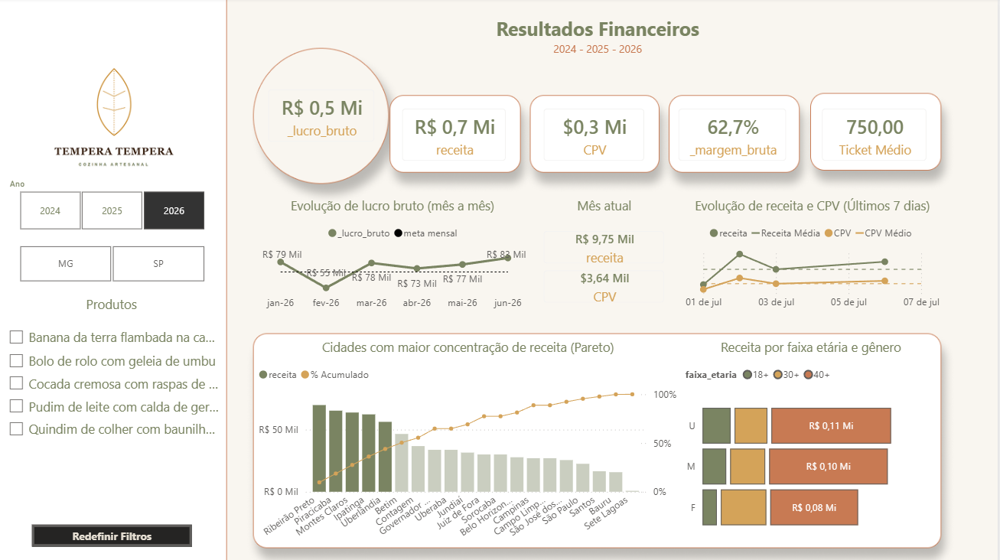

<div align="center">


# 🍃 Tempera Tempera

### *Data Engineering Study Case*

<p>
Projeto de Engenharia de Dados orientado por metadados para geração automática de dados relacionais de uma rede fictícia de restaurantes.
</p>


</div>

---

# 🌿 Sobre o projeto

> **Paleta visual**
>
> - 🤍 Algodão Cru `#F9F6F0`
> - ☕ Terra Molhada `#4A3525`
> - 🌰 Tronco Envelhecido `#7A7067`
> - 🍂 Terracota `#C87A53`
> - 🌾 Ouro Velho `#D4A359`
> - 🌿 Folha Seca `#7A8462`

O projeto **Tempera Tempera** demonstra como estruturar uma solução de Engenharia de Dados limpa, organizada e orientada por metadados utilizando **Python, YAML, Pandas e Power BI**.

O foco está na arquitetura da aplicação, simplicidade do código e facilidade de manutenção.

---

# 🍂 Arquitetura

```text
        YAML Metadata
              │
      Configuração (.env)
              │
              ▼
      Fake Data Generator
              │
      Pandas DataFrames
              │
        Landing Layer
              │
          Power BI
```

---

# ✨ Principais características

- 🌿 Configuração centralizada via `.env`
- 🍂 Schemas definidos em YAML
- 🌾 Dados relacionais consistentes
- 🍃 Pipeline simples e modular
- 🪴 Código desacoplado
- 📊 Integração com Power BI

---

# 📈 Projeto em números

|Indicador|Valor|
|---|---:|
|Tabelas geradas|13|
|Arquivos YAML|13|
|Camada implementada|Landing|
|Linguagem|Python|
|Biblioteca principal|Pandas|
|Visualização|Power BI|

---

# 📁 Estrutura

```text
Tempera-Tempera
├── main.py
├── .env
├── requirements.txt
├── metadata/
├── utils/
├── landing/
└── docs/
```

---

# 🌱 Pipeline

1. Carrega configurações do `.env`
2. Lê os metadados YAML
3. Cria os DataFrames relacionais
4. Persiste na Landing
5. Consome os dados no Power BI

---

# 🪴 Tecnologias

- Python
- Pandas
- Faker
- YAML
- python-dotenv
- Power BI

---

# 🚀 Execução

```bash
python -m venv venvv
venvv\Scripts\activate
pip install -r requirements.txt
python main.py
```

---

# 🌾 Roadmap

- [x] Geração de dados fictícios
- [x] Arquitetura modular
- [x] Configuração por YAML
- [x] Landing Layer
- [ ] Bronze
- [ ] Silver
- [ ] Delta Lake
- [ ] Data Vault
- [ ] Docker
- [ ] Testes automatizados

---
### Power BI

<div align="center">

### 🌿 Dados bem organizados também contam boas histórias.

**José Carlos Silva**

</div>
